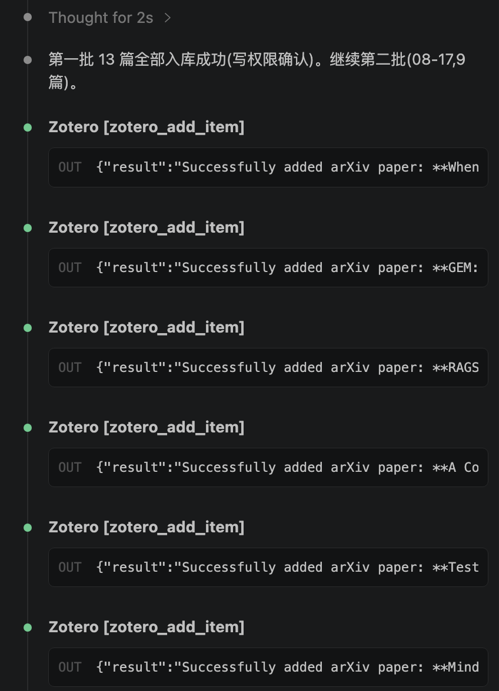
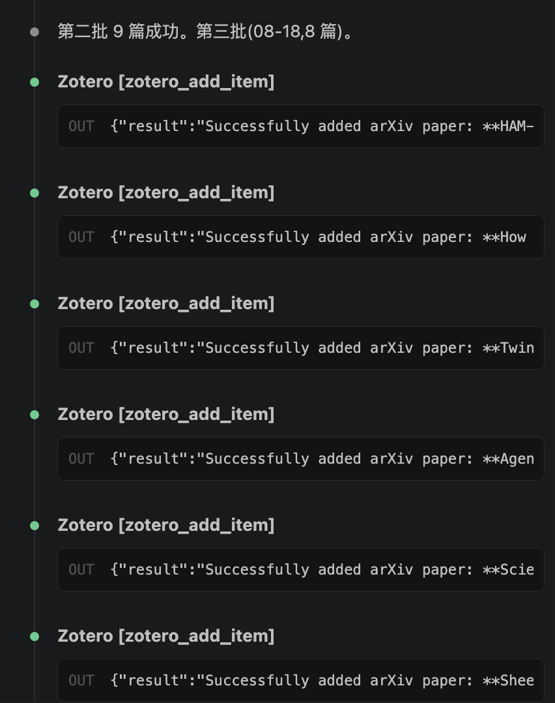
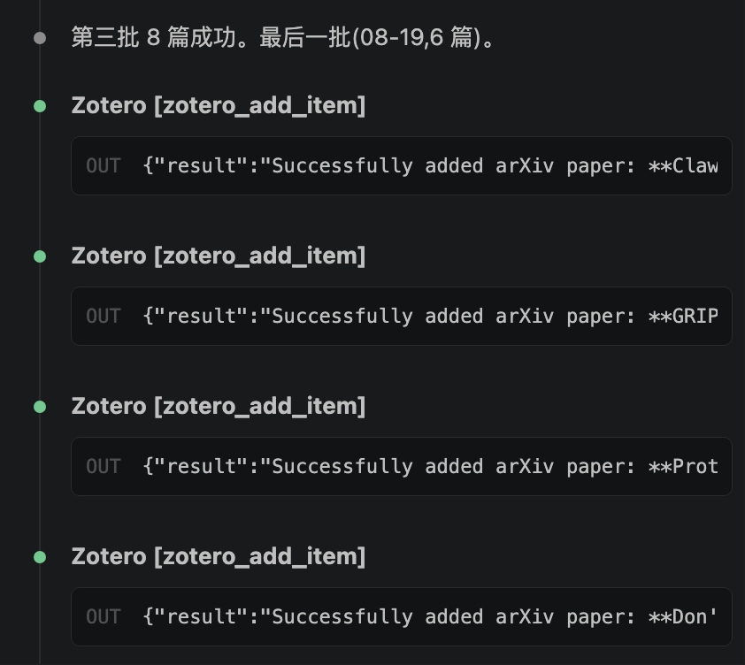

# 0601-ZoteroIdentifierImporter

通过标识符（arXiv ID / DOI / ISBN / URL / BibTeX）批量将论文入库到 Zotero 指定收藏夹（默认 `00_Inbox`），入库成功后清理源文件中已归档的标识符片段。

## 使用方法

**触发方式**：当用户给出 `arXiv\_Inbox / DOI\_Inbox / ISBN` 等标识符片段，并要求「通过标识符添加条目 / 入库到 Zotero / 添加到 00_Inbox / import by identifier」时使用。

**输入格式**（用户粘贴的标识符片段）：

```
arXiv\_Inbox

2605.28424v1
2604.03088v3

DOI\_Inbox

10.32629/mcmf.v5i4.2573
```

**执行流程**：

1. **检查目标收藏夹可读写** — 通过 `zotero_search_collections(query="00_Inbox")` 确认收藏夹存在并获取 key；用第一个标识符执行一次 `zotero_add_item` 验证读写能力（该条目同时计入入库结果）。
2. **逐个通过标识符添加条目** — 调用 `zotero_add_item`：
   - **source**：arXiv ID 一律转为 `https://arxiv.org/abs/<ID>`（去掉 `v1`/`v2` 版本后缀）；DOI 直接用 DOI 字符串（走 CrossRef）；ISBN 直接用 ISBN；BibTeX/CSL JSON 支持批量。
   - **collections**：目标收藏夹 key（如 `BIWJX4IB`）。
   - **if_exists**：`file`（已存在时复用条目，补充缺失的收藏夹/附件，绝不删除或修改已有条目）。
   - **attach_mode**：`auto`（自动附加开放获取 PDF）。
   - 多个标识符可并行调用 `zotero_add_item`，逐个记录成功/失败。
3. **清理源文件已入库片段** — 用 Edit 从源文件中删除所有成功入库的标识符行；保留 Inbox 标题与整体文档结构；失败条目保留在源文件中并向用户汇报。

**汇报格式**：成功条目表格（# / 标识符 / 论文标题 / 状态）；「失败条目 list」失败标识符清单（无失败则写「空（无）」）。

## 实现效果

批量入库 36 篇 arXiv 论文（2026-08-13 ~ 2026-08-19 每日总结追踪）到 `00_Inbox`（key: `BIWJX4IB`）：

| 批次 | 日期 | 篇数 |
|------|------|------|
| 第一批 | 08-13 + 08-14 | 13 |
| 第二批 | 08-17 | 9 |
| 第三批 | 08-18 | 8 |
| 第四批 | 08-19 | 6 |








> 说明：示例中 35/36 篇因 Zotero 云存储配额已满（300 MB）未附加 PDF，元数据已完整入库；`if_exists=file` 保证重复入库时自动复用已有条目。
